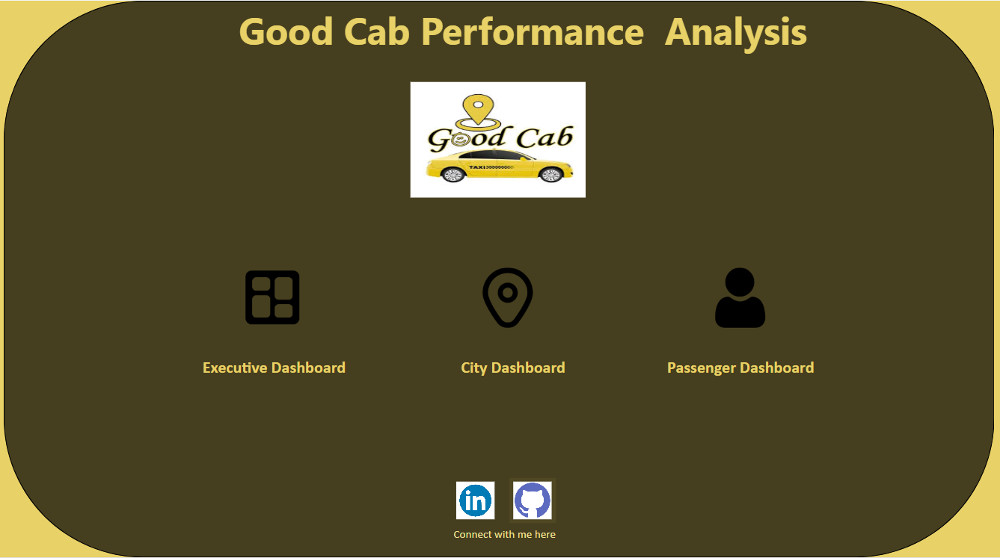
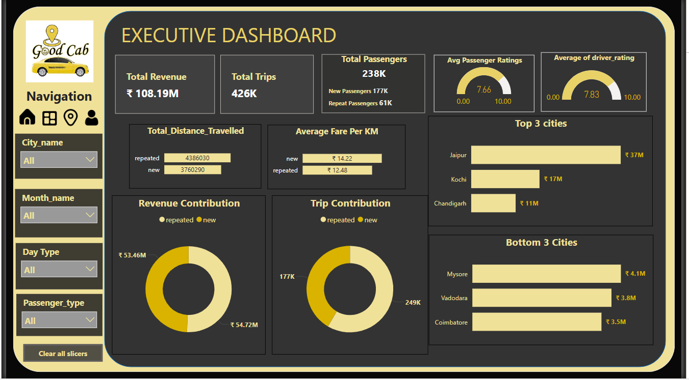
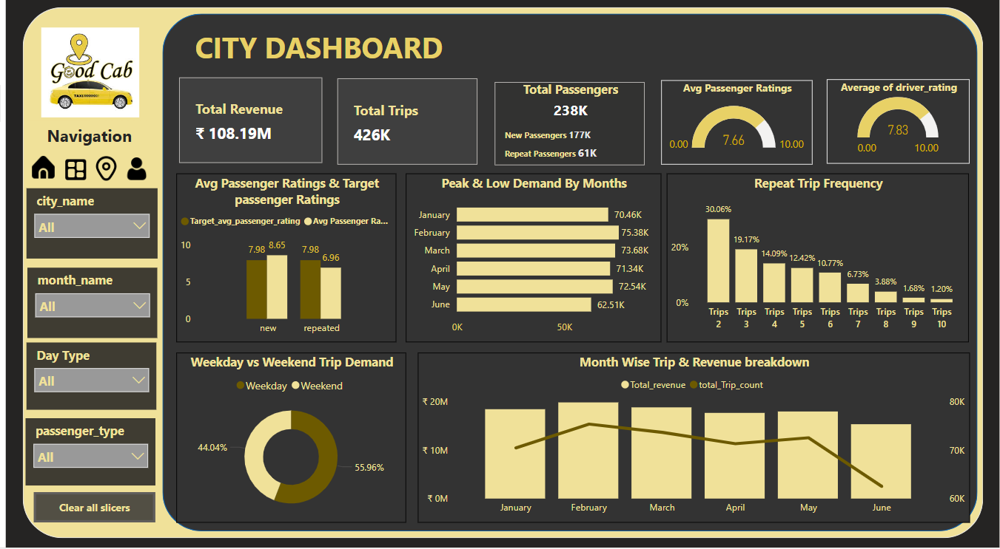
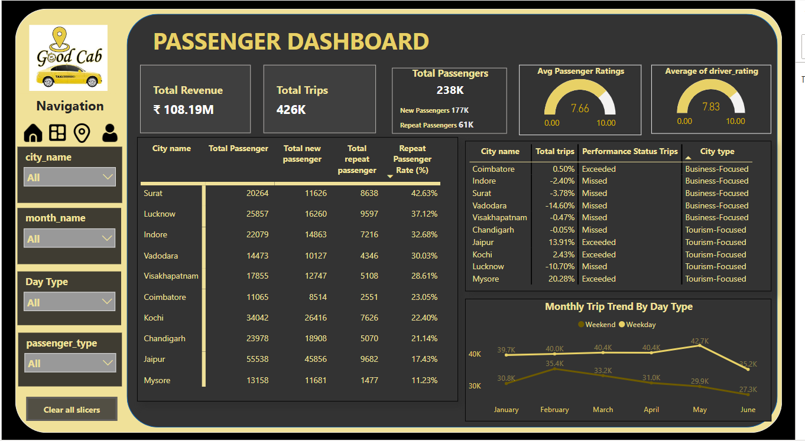

# 🚖 Good Cabs Performance Dashboard – Power BI Project

**Date:** May 2025  
**Role:** Data Analyst  
**Technologies:** Power BI, Power Query, DAX  
**Data Source:** Good Cab Transportation CSV Data (May–Jun 2025)

---

##  Project Overview
 

###  Background  
Good Cabs, a fast-growing urban mobility service provider, needed insights into its trip volume, passenger satisfaction, and city-level performance. As the Data Analyst on the team, I developed a comprehensive Power BI dashboard to help stakeholders monitor performance, identify underperforming regions, and improve customer retention.

###  Objective  
To clean and model the data using **Power Query**, build KPIs using **DAX**, and visualize operational insights to help the business:

- Understand trends in trips, revenue, and customer behavior  
- Identify cities with growth opportunities or concerns  
- Compare new vs repeat customer dynamics  
- Track performance against targets at city and company level  

---

 

##  Key Metrics & Highlights

- **Total Trips**: 426,000  
- **Total Revenue**: ₹108M  
- **Passengers Served**: 238K  
  - New: 177K  
  - Repeat: 61K  
- **Average Ratings**:  
  - Passenger: 7.66 / 10  
  - Driver: 7.83 / 10  
- **Total Distance Travelled**:  
  - New: 3.7M KM  
  - Repeat: 4.3M KM  
- **Average Fare per KM**:  
  - New: ₹14.22  
  - Repeat: ₹12.48  
- **Top Cities (by Revenue)**: Jaipur, Kochi, Chandigarh  
- **Bottom Cities**: Mysore, Vadodara, Coimbatore  

---

##  City & Passenger Insights

###  City Dashboard Highlights  

  

- **Passenger Satisfaction**:  
  - New: 8.65 (higher than target)  
  - Repeat: 6.96 (needs improvement)  
- **Peak Months**: February & March  
- **Low Demand Month**: June  
- **Weekday vs Weekend Trips**:  
  - Weekday: 56%  
  - Weekend: 44%  
- **Repeat Trip Drop-off**:  
  - Only 1.2% reached 10+ trips  
  - 30% completed a 2nd trip  

###  Passenger Dashboard Highlights 

- **Highest Repeat Rate**: Surat (42.63%)  
- **Lowest Repeat Rate**: Mysore (11.23%)  
- **Performance Against Target**:  
  - Exceeded: Mysore, Jaipur, Coimbatore  
  - Missed: Lucknow, Indore, Vadodara  

---

##  Business Recommendations

- Strengthen **loyalty programs** to retain new customers  
- Investigate reasons for low repeat satisfaction  
- Allocate marketing spend in **underperforming cities**  
- Launch **seasonal campaigns** to recover June's slump  
- Use **Surat’s repeat strategy** in other cities  

---

##  Tools & Technologies

- **Power BI**: Dashboard development & data storytelling  
- **Power Query**: Data transformation & cleanup  
- **DAX**: Custom metrics like Avg Fare/KM, Retention %, Target vs Actual

---

##  Business Impact

The Good Cabs dashboard empowered leadership to make **data-driven operational and marketing decisions**. It brought visibility into customer satisfaction, regional performance, and repeat behavior—enabling targeted interventions to boost trip volume and retention.

---

##  View the Dashboard

**[ Click here to view the full Power BI Dashboard](#)**(https://app.powerbi.com/view?r=eyJrIjoiNWM1ZWJhMDItYzQ2Ni00OTcwLWI5NzItNmM1Y2IzOGM3M2ZlIiwidCI6ImM2ZTU0OWIzLTVmNDUtNDAzMi1hYWU5LWQ0MjQ0ZGM1YjJjNCJ9)*

Created by ,
### *Vidyalaxmi Mallya*
#### Data Analyst 
